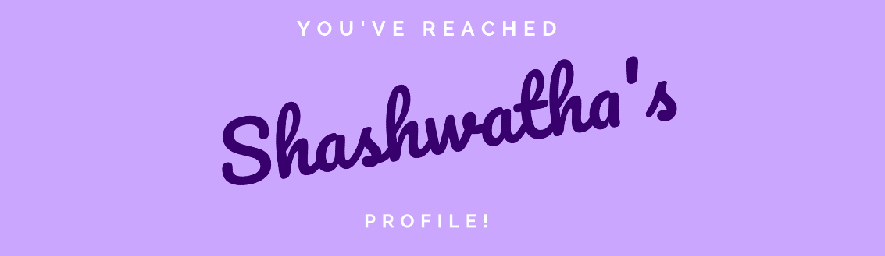

# Hello there 👋
- 🌱 I’m currently pursuing Computer Science & Engineering 
- 🤔 I’m excited to work on web development projects
- 🔭 Currently tracing my path to becoming a software developer
- 📫 How to reach me: [LinkedIn](https://www.linkedin.com/in/shashwatha-karkera-64bb58202/)

## Some Math :bar_chart:

<!--
**shashwatha411/shashwatha411** is a ✨ _special_ ✨ repository because its `README.md` (this file) appears on your GitHub profile.

Here are some ideas to get you started:

- 🔭 I’m currently working on ...
- 🌱 I’m currently learning ...
- 👯 I’m looking to collaborate on ...
- 🤔 I’m looking for help with ...
- 💬 Ask me about ...
- 📫 How to reach me: ...
- 😄 Pronouns: ...
- ⚡ Fun fact: ...
-->
